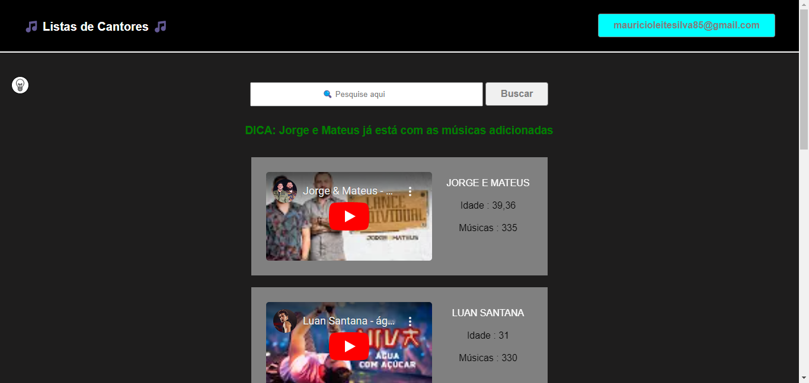

# Projeto de Introdução ao desenvolvimento web

Lista de Cantores

## Deploy
https://maumau1998.github.io/projeto-intro-web/

## Stack utilizada :
* HTML 5
* CSS 3
* JavaScript

## Funcionalidade

1- Home

Para ter acesso é necessário fazer o cadastro, após o cadastro você terá acesso a lista de cantores. A home possui uma barra de pesquisa e um botão de pesquisar, o usuário pode fazer apenas uma pesquisa por cadastro. A página sempre será recarregada quando o usuário tentar pesquisar duas vezes.

## Sobre mim

Olá, me chamo Mauricio! sou apaixonado por Programação e Pentest 😍

## Links

linkedin: https://www.linkedin.com/in/maur%C3%ADcio-leite-silva-aa375b16a/  
github: https://github.com/maumau1998